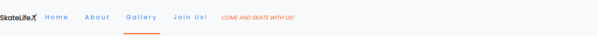
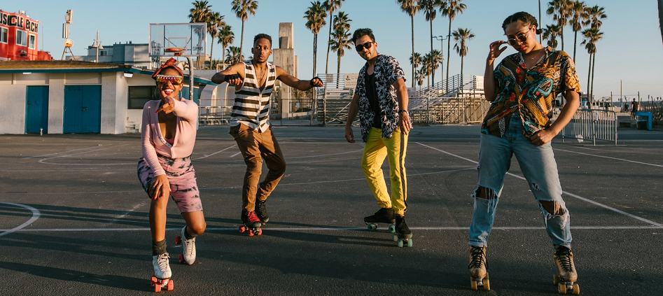
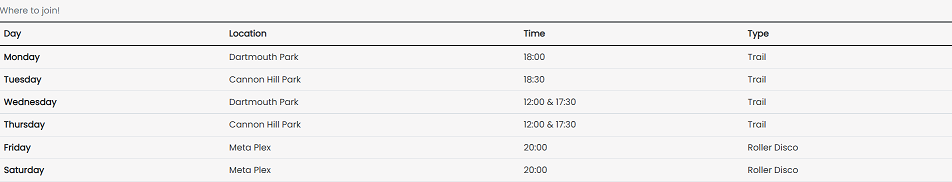
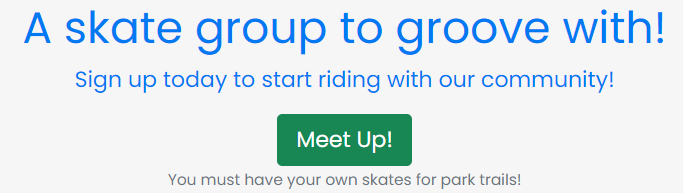
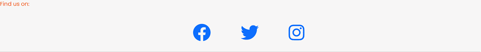
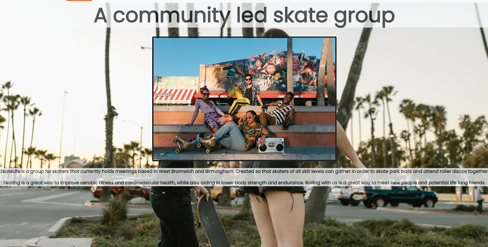
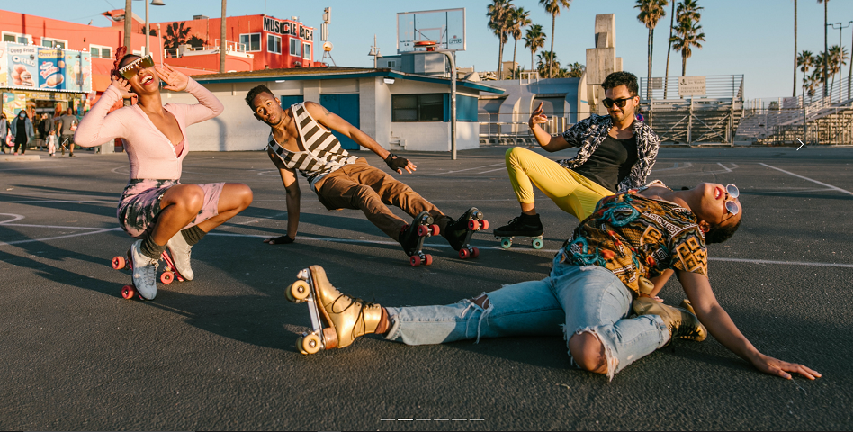
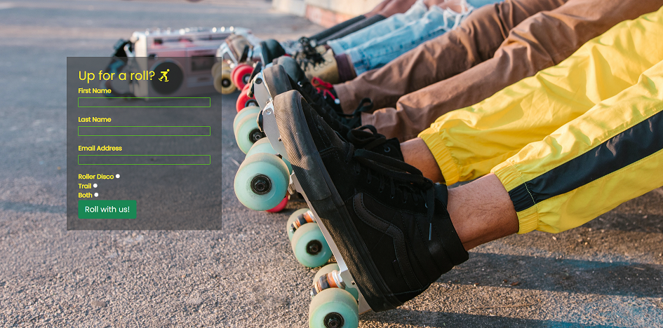

# SkateLife

Skatelife is a site that is aimed at novice and experienced skaters alike, with the intent to keep people socialising and sharing their knowledge of skate tips and tricks while meeting up for regular skate sessions at local parks and venues. This is for areas in and near West Bromwich and Birmingham, UK. It is also aimed at those wanting to keep fit by going on regular skate trails and provides information on when and where to meet others to do so if desired.

## User Experience (UX)

-   ### User stories

    -   #### First Time Visitor Goals

        1. As a First Time Visitor, I want to easily understand the main purpose of the site and learn more about the community.
        2. As a First Time Visitor, I want to be able to easily navigate throughout the site to find content.
        3. As a First Time Visitor, I want to locate their social media links to see their followings on social media to determine how trusted and known they are.

    -   #### Returning Visitor Goals

        1. As a Returning Visitor, I want to find information about skate locations and meeting times.
        2. As a Returning Visitor, I want to find the best way to get in contact with the community with any questions I may have.
        3. As a Returning Visitor, I want to find community links.

    -   #### Frequent User Goals
        1. As a Frequent User, I want to check to see if there are any newly added locations and areas to skate.
        2. As a Frequent User, I want to check to see if there are any new gallery images of skating events.
        3. As a Frequent User, I want to see if there are any time and location changes for meetups.

-   ### Design
    -   #### Colour Scheme
        -   The two main colours used were blue and orange, noticable in the nav and footer of the pages. These two colours were chosen as they aided in vibrancy while maintaining readability and also complimented most of the images used on the site.
    -   #### Typography
        -   The Poppins font is the main font used throughout the whole website with Sans Serif as the fallback font in case for any reason the font isn't being imported into the site correctly. Poppins is a rounded font that is inviting and easy to read so it is both attractive and appropriate.
    -   #### Imagery
        -   All imagery was sourced from the website, [Pexels.](https://www.pexels.com/) The large images used are intended to be striking and catch the user's attention. The images chosen also have a vibrant and energetic charm to them which is inviting and friendly feeling.

## Features
### Existing Features

- __Navigation Bar__

  - The navigation bar can be found on all pages and is responsive to screen size changes. It includes links to the Logo, Home page, About page, Gallery and Join us page and is identical in each page to allow for easy navigation. As well as allowing users to intuitively navigate the site, the current page that the user is on is highlighted as active, so that the user always knows what page they are currently viewing.
  - At smaller screen sizes the navigation bar uses the hamburger navigation icon to collapse the navigation links. This will allow the user to easily navigate from page to page across all devices without having to revert back to the previous page via the ‘back’ button.
  - The navbar text "come and skate with us!" was added to the right of the links and is a quick insight into what the site aims to achieve, getting people to join.

  

- __The landing page image__

  - The landing includes an image of skaters all facing the camera as if they are looking directly at the user. This is intended so that the user feels like they are the direct recipient and intended audience for the page. The image is fully responsive so that it always maintains the intended effect on all screen sizes.

  

- __Meetup Table__

  - This section will allow the user to see exactly when the meetups will happen and where they will be located throughout the week. 
  - This section will be updated as these times change and locations are added to keep the user up to date.

  

- __Meetup Button__

  - This feature allows the user to go from the Home page directly to the Join Us page while providing important information in regard to park trails.

  

- __The Footer__ 

  - The footer section includes links to the relevant social media sites for SkateLife. All of the links in the footer will open to a new tab to allow easy navigation for the user. 
  - The footer is valuable to the user as it encourages them to keep connected via social media and will supplement communication and gallery images.


  

- __About__

  - The about page gives the user information about what Skatelife is and what the intentions of the site are.
  - The page also touches on who can join and the benefits of joining.
  - An image is displayed on bigger screen sizes of skaters hanging out together to highlight the interaction of skaters on the events.

  

- __Gallery__

  - The gallery will provide the user with supporting images to see what the meet ups look like. 
  - This section is valuable to the user as they will be able to easily identify the types of events the community puts together.
  - The gallery page has indicators so that users know how to navigate through the images and how many images are currently able to be viewed.

  

- __Join Us__

  - The join us page is intended for users to sign up with SkateLife so that they can start skating with the community asap.
  - Users are given the fields of first name, last name and email address to enter alongside the selection of choosing whether they want to join the skate trail, roller disco or both. These fields are required so that information is not missing when signing up.
  - The text entry fields are highlighted when hovered over so that users know where they are going to start typing.

  

## Testing

The testing for SkateLife was done using the Google Chrome Browser and their Chrome Developer Tools to make note of how the site responded when different screen sizes were used. Testing was also done on Microsoft edge and an iPhone XR using Safari to make sure the website renders correctly on different browsers and devices. No such errors were found.

### User Stories Testing

1. As a user visiting the site for the first time, I want to easily understand the main purpose of the site.
    * The home page allows the user to see what the intention of the site is with the use of text, the hero image, the meetup table and the meet up button.
    * The About page also touches on what Skatelife is and the benefits of using it.
2. As a first time user, I want to be able to easily navigate throughout the site to find content.
    * A user can navigate through the sites content easily using the navbar that can be accessed on every page. The logo also redirects to the home page.
3. As a first time user, I want to locate their social media links to see their followings on social media to determine how trusted and known they are.
    * Links to the social media pages can be found in the footer of the site that is available on every page.
4. As a returning user, I want to find information about skate locations and meeting times.
    * This is readily available on the home page as the meetup table provides both the skate location and meeting times. This would be updated when new skate venues and times are added.
5. As a frequent user, I want to check to see if there are any new gallery images of skating events.
    * A user would be able to find all new images on the gallery page as well as by using the instagram link in the footer.

### Validator Testing 

- HTML
  - No errors were returned when passing through the official [W3C validator](https://validator.w3.org/)
- CSS
  - No errors were found when passing through the official [Jigsaw validator](https://jigsaw.w3.org/css-validator/)

### Known Bugs

-  The index.html page has a horizontal side scroll which can cut off some wording when positioned on the right of the screen. This creates extra whitespace alongside the right length of the screen which isn't needed.

## Deployment

  The project was deployed to github pages using the following steps:
  
  1. On GitHub, navigate to your site's repository.
  2. Under your repository name, click  *Settings*.
  3. In the left sidebar, click Pages.
  4. Under "GitHub Pages", use the *Branch* drop-down menu and select a publishing source.
  5. Optionally, use the drop-down menu to select a folder for your publishing source.
  6. Click Save.
  7. Once refreshed and successfully deployed, your published site link should be at the top of "Github Pages"

## Forking a GitHub Repository
  1. Login to GitHub.
  2. Locate your desired repository.
  3. Locate the fork option in the top-right hand corner of the repository page.    
  4. You will be asked where you want to fork it to.

## Cloning a repository using the command line
  1. On GitHub, navigate to the main page of the repository.
  2. Above the list of files, click download code.
  3. To clone the repository using HTTPS, under "Clone with HTTPS", click the copy icon. To clone the repository using an SSH key, including a certificate issued by your organization's SSH certificate authority, click *Use SSH*, then click the copy icon. To clone a repository using GitHub CLI, click Use *GitHub CLI*, then click the copy icon.
  4. Open Terminal.
  5. Change the current working directory to the location where you want the cloned directory.
  6. Type ```git clone```, and then paste the URL you copied earlier.

      ```
      $ git clone https://github.com/YOUR-USERNAME/YOUR-REPOSITORY
      ```

  7. Press Enter to create your local clone.

      ```
      $ git clone https://github.com/YOUR-USERNAME/YOUR-REPOSITORY
      ```
      ```
      \> Cloning into \`Spoon-Knife`\...

      \> remote: Counting objects: 10, done.

      \> remote: Compressing objects: 100% (8/8), done.

      \> remove: Total 10 (delta 1), reused 10 (delta 1)

      \> Unpacking objects: 100% (10/10), done.
      ```

## Credits
  * ## Imagery
      * All imagery was found from RODNAE Productions on [Pexels](https://www.pexels.com/@rodnae-prod/)
      * The social media icons in the footer and the icon for the logo were accessible through [Font awesome](https://fontawesome.com/)
      * Using a background image with bootstrap 5 was found via this [Youtube video](https://www.youtube.com/watch?v=VCVxtpjgO5Q)
  * ## Code
      * Bootstrap libraries was the base for the entire website in order to ensure it's responsivity.
      * CI form tutorial was used to create form on Join Us page
      